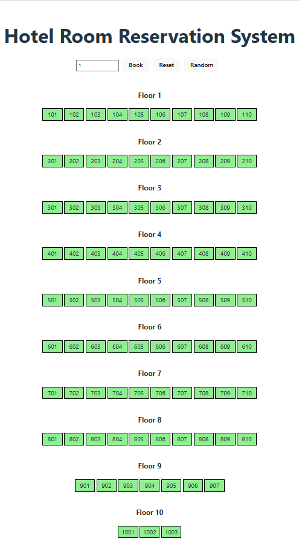

# Hotel Room Reservation System

Welcome to the Hotel Room Reservation System, a React-based web application built using React 19 and Vite. This system allows users to book rooms in a hotel with 97 rooms across 10 floors, optimizing for minimal travel time between booked rooms and providing an interactive UI for managing bookings.

## Table of Contents
- [Description](#description)
- [Features](#features)
- [Prerequisites](#prerequisites)
- [Installation](#installation)
- [Usage](#usage)
- [Project Structure](#project-structure)
- [Functionality](#functionality)
- [Styling](#styling)
- [Deployment](#deployment)
- [Contributing](#contributing)
- [License](#license)
- [Contact](#contact)

## Description

The Hotel Room Reservation System is designed to simulate a hotel with 97 rooms distributed across 10 floors, following specific room numbering and booking rules. Users can book up to 5 rooms at a time, with priority given to rooms on the same floor and optimization for minimizing travel time (1 minute horizontally, 2 minutes per floor vertically). The system includes a visual grid of rooms, a booking interface, and options to generate random occupancy or reset bookings.

## Features
- Book up to 5 rooms at a time.
- Prioritize booking rooms on the same floor.
- Minimize total travel time between booked rooms (horizontal: 1 minute, vertical: 2 minutes per floor).
- Visualize available (green) and booked (red) rooms across 10 floors.
- Generate random room occupancy for testing.
- Reset all bookings to start fresh.
- Responsive and user-friendly interface built with React 19 and styled with CSS.

## Prerequisites
Before you begin, ensure you have the following installed: